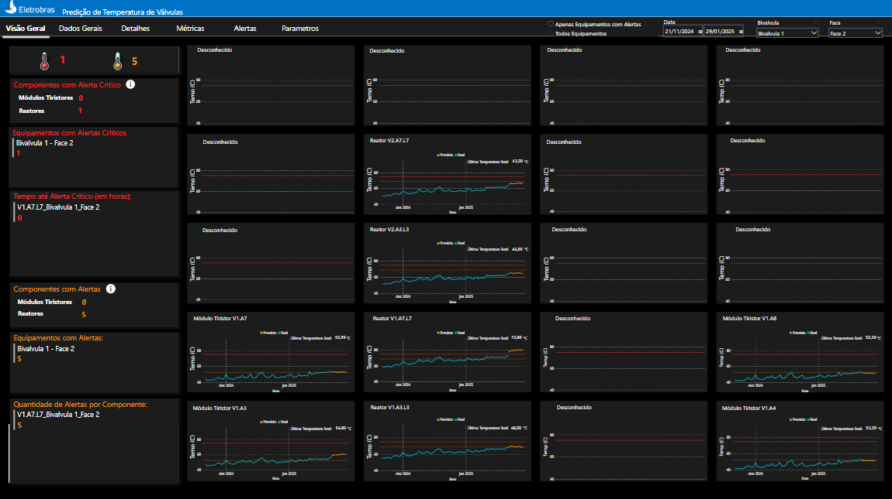
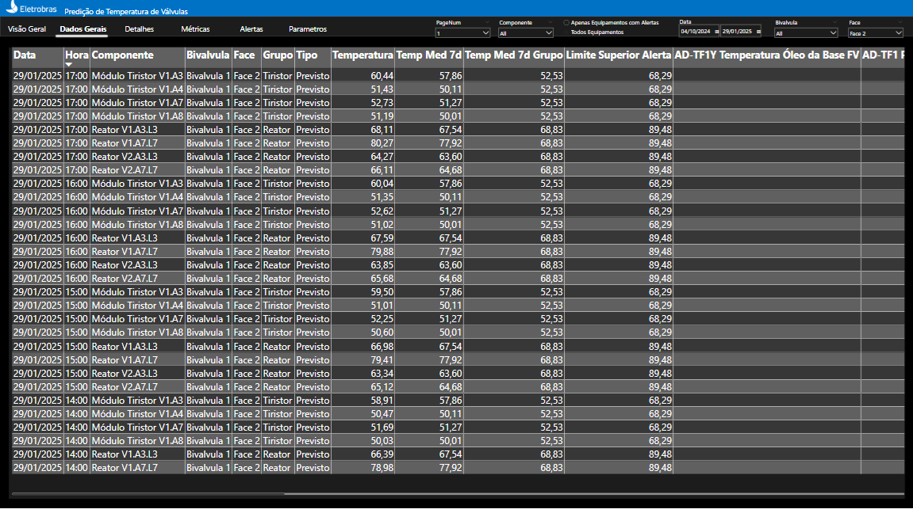
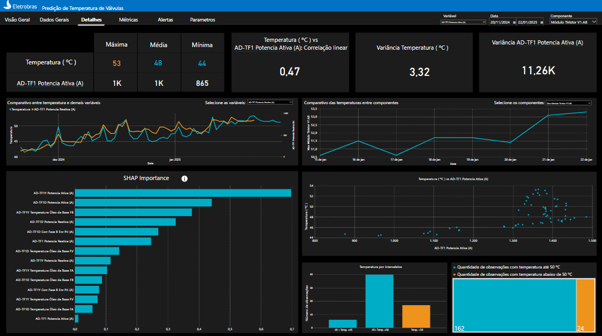
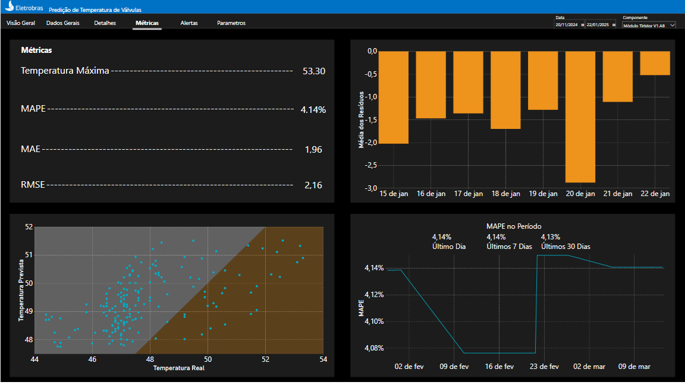
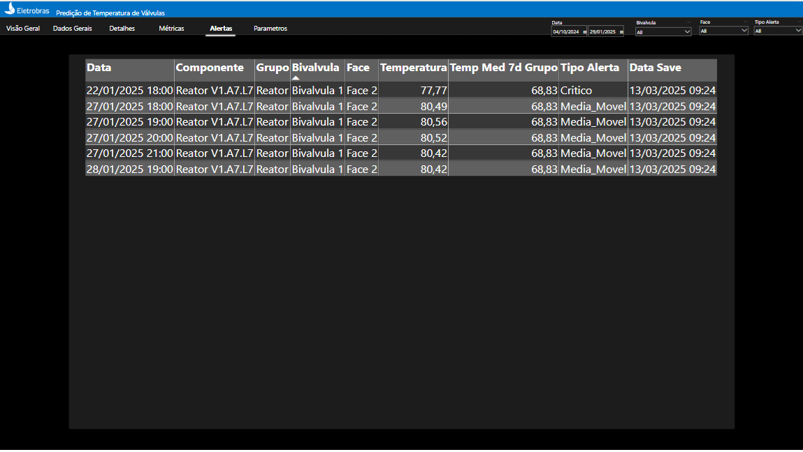
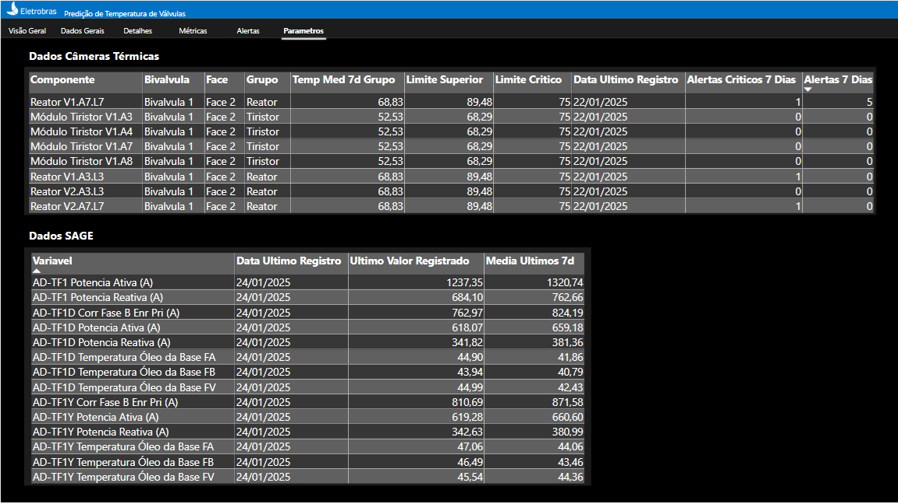

Dashboard
=========

O dashboard do projeto de previsão de temperatura do HVDC tem como objetivo disponibilizar para o seu usuário um registro do histórico de temperaturas da sala de válvula que estamos monitorando (além de outras variáveis adcionais) assim como a previsão de temperatura para duas semanas futuras.

Para tanto contamos com duas abas:

Visão Geral
-----------

As funcionalidades presentes na aba "Visão Geral" são:

* Monitorar os dados históricos de temperatura: série histórica de temperatura das válvulas iniciada em novembro de 2024. A série informa o valor máximo por dia.
* Previsão de temperatura: Valores previstos de temperatura para duas semanas após o fim da nossa série real. A série informa o valor máximo previsto para o dia.
* Indicadores para alertas: Sempre que a previsão indicar valores 30% superiores a média móvel dos últimos 7 dias, o visual irá indicar um alerta.
* Indicadores para alertas críticos: Sempre que o a temperatura ultrapassar os 90 graus Célsius, teremos uma indicação de alerta crítico.
* Filtros: É possível filtrar apenas as válvulas para os quais a previsao indica alerta ou considerar todas; selecionar a bivalvula ou face específicas.

Obs: Atualmente contamos com uma câmera térmica na sala de válvulas, logo, está sendo monitorada apenas uma biválvula e uma face.

Dados Gerais
------------

As funcionalidades presentes na aba "Dados Gerais" são:

* A aba conta com todo o histórico de dados utilizados para gerar as previsoes de temperatura assim como as demais estatísticas descritivas.
* Filtros: Filtro por página, por componente, apenas equipamentos com alestas ou todos, por datas, por biválvula e face.

Detalhes
--------

As funcionalidades presentes na aba "Detalhes" são:

* Estatísticas descritivas: Estatísticas que analisam a correlação linear entre temperatura e as demais variáveis assim como estatísticas univariadas (variância).
* Gráfico temperatura x outras variáveis: Gráfico que possibilita ver a série de valores reais de temperatura e comparar com as demais variáveis presentes da base de dados (corrente, potência, tensão).
* Gráfico temperaturas de diferentes componentes: Gráfico que possibilita comparar as séries de temperatura de diferentes componentess.
* Gráfico de SHAP importance: Gráfico que informa o quanto cada uma das variáveis listada é relevante para explicar a variação da temperatura.
* Gráfico de dispersão: Gráfico de dispersão entre a variável de temperatura e outra variável independente selecionada no filtro.
* Gráficos de barras: Gráficos com a quantidade de observações por faixa de temperatura.
* Filtros: Filtro por componente, por período de tempo e por variável a ser comparada com a temperatura.

Métricas
--------

As funcionalidades presentes na aba "Métricas" são:

* Métricas de avaliação do modelo: Métricas que avaliam a acurácia do modelo de previsao de temperatura (MAPE, MAE, RMSE).
* Gráfico de resíduos: Resíduos por data.
* Gráfico de dispersão: Gráfico entre os valores reais e os valores previstos de temperatura considerando o período de teste.
* Série histórica do MAPE: Série com os valores de MAPE das diferentes estimações.
* Filtros: Filtros de data e componente.

Alertas
-------

As funcionalidades presentes na aba "Alertas" são:

* Tabela de alertas: Tabela que detalha as quantidades de Alertas e Alertas Críticos por componentes.
* Filtros: Data, biválvula, face, tipo de alerta.

Parametros
----------

As funcionalidades presentes na aba "Alertas" são:

* Tabelas de alertas: Tabelas com as quantidades de alertas dos últimos 7 dias e com os dados de todas as fontes, não apenas temperatura.
